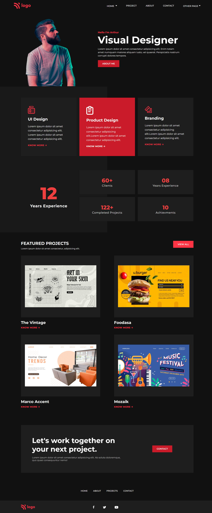

# Product Design Landing Page 

Hello,

I'm `Ammar Azam Khan`. This is the 15th assignment in my `Full Stack Javascript Bootcamp`, where I developed this website. This site is completely responsive.

The Landing page contains:

- Navbar
- Hero Section
- Service Section
- Featured Project Section
- Footer

## 🛠 Technologies Used

&emsp; &ensp;  

## 💻 Check out the link below for a preview.

&emsp; &ensp; &ensp;[Live Preview](https://product-design-profile.netlify.app)

## 📸 Screenshot

## 📝 My learning from this project

- Use of new HTML5 semantic tags.
- Use of CSS variable.
- Use of Flexbox for elements alignment.
- Use of ::before and ::after Pseudo Selector.
- Media queries for responsive design.

## ⌛ Time taken to finish the project

- Approximately `6 hours`.
